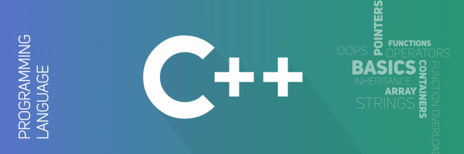

```JavaScript
/*
 * @Author: Yu Enci
 * @Description: The Notes of the level 1 semester 2 IDB lab
 * @Date: 2023-03-23 00:26:25
 * @LastEditTime: 2023-03-23 00:26:25
 * @FilePath: E:\Code Everyday\2023-02\0228-Minimalist-CPP-Tutorial
 */
```

# Minimalist-CPP-Tutorial



This is a minimalist C++ tutorial designed to help beginners grasp the fundamentals of the programming language.


## Table of Contents

- Getting Started with C++
- Basic Syntax in C++
- Control Flow in C++
- Functions in C++
- Object-Oriented Programming in C++
- C++'s Built-In Data Structures
- File operations and modularize in C++


## 1. Getting Started with C++

To get started with C++, you need to have a C++ compiler installed on your computer. You can download a compiler such as [Visual Studio](https://visualstudio.microsoft.com/downloads/) or [Code::Blocks](http://www.codeblocks.org/downloads/binaries) for free.

[> Learn now!](https://github.com/yuenci/Minimalist-CPP-Tutorial/blob/main/tutorial/1.Getting%20Started.md)

## 2. Basic Syntax in C++

C++ syntax is similar to that of C, but with additional features. In this tutorial, I will cover the basics of C++ syntax, including keywords, operators, comments, and more.

[> Learn now!](https://github.com/yuenci/Minimalist-CPP-Tutorial/blob/main/tutorial/2.Basic%20Syntax.md)

## 3. Control Flow in C++

Control flow refers to the order in which statements in a program are executed. In C++, there are several structures that control the flow of execution in a program. we will cover each of these structures in detail, and provide examples of how they can be used in your programs.

[> Learn now!](https://github.com/yuenci/Minimalist-CPP-Tutorial/blob/main/tutorial/3.Control%20Flow.md)

## 4. Functions in C++

Functions are a fundamental part of C++ programming. They are used to perform specific tasks and can be called from other parts of the program. In this tutorial, we will learn how to define and call functions in C++.

[> Learn now!](https://github.com/yuenci/Minimalist-CPP-Tutorial/blob/main/tutorial/4.Functions.md)

## 5. Object-Oriented Programming in C++

C++ is an object-oriented language that provides features such as encapsulation, inheritance, and polymorphism. In this section, I will cover the basics of defining classes, creating objects, and implementing inheritance and polymorphism. By understanding these concepts, you can write more modular and maintainable code.

[> Learn now!](https://github.com/yuenci/Minimalist-CPP-Tutorial/blob/main/tutorial/5.Object-Oriented%20Programming.md)

## 6. C++'s Built-In Data Structures

Structures are used to group variables of different data types under a single name. In this tutorial, we will learn how to declare structures, access their members, and use them in your programs.

[> Learn now!](https://github.com/yuenci/Minimalist-CPP-Tutorial/blob/main/tutorial/6.Built-In%20Data%20Structures.md)

## 7. File operations and modularize in C++

We will learn basic file reading and writing operations, as well as how to create and import modules from different files, such as functions, classes, etc.

[> Learn now!](https://github.com/yuenci/Minimalist-CPP-Tutorial/blob/main/tutorial/7.File%20and%20modularize.md)


## Conclusion

Congratulations, you've completed this minimalist C++ tutorial! We hope this tutorial has provided you with the foundational knowledge you need to start writing simple C++ programs.


## Acknowledgments

* [Codecademy](https://www.codecademy.com/learn/c-plus-plus-for-programmers/modules/getting-started-with-c-plus-plus/cheatsheet)
* [geeksforgeeks](https://www.geeksforgeeks.org/c-plus-plus/)
